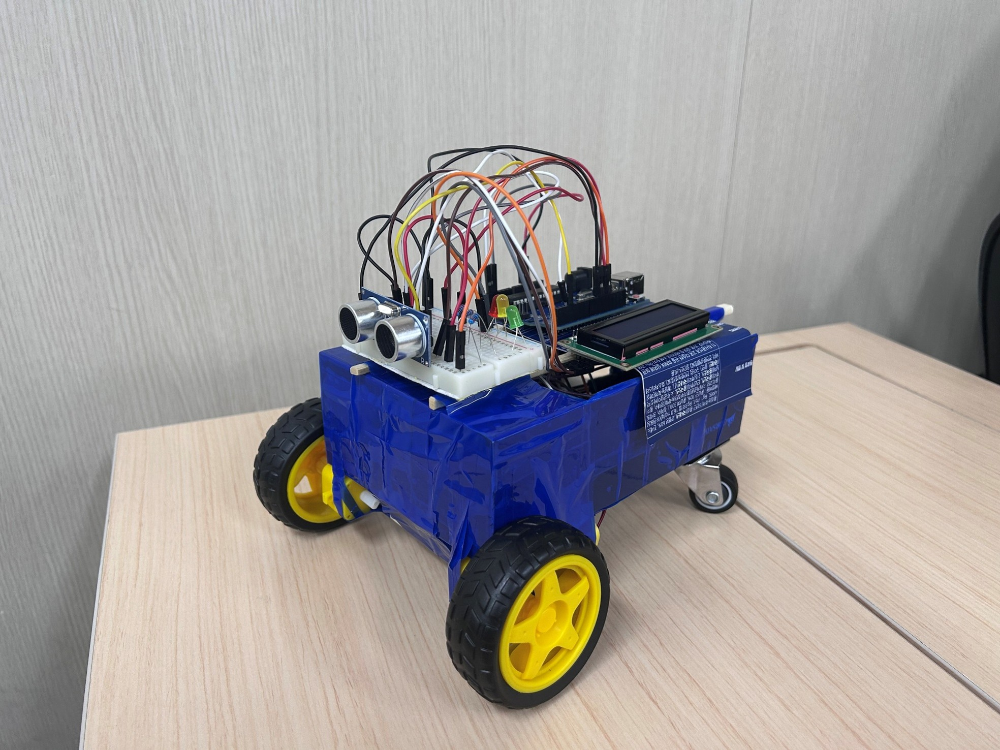
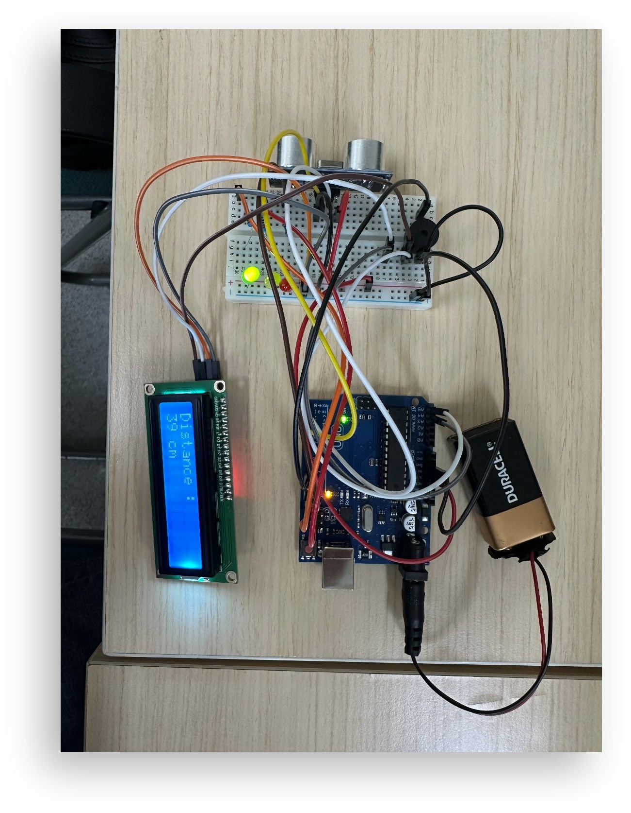
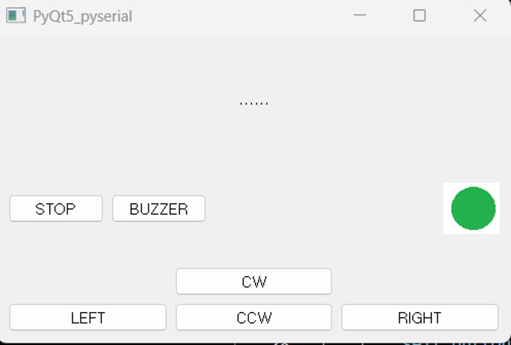
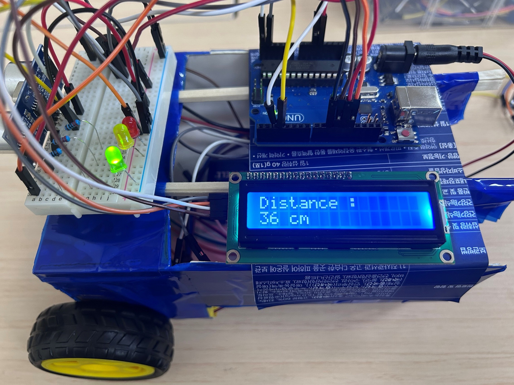

<h1>🛡️ Safety Echo Kit (부착형 안전거리 감지 키트)</h1>

전동 휠체어나 산업 현장 중장비의 사각지대 사고를 방지하기 위해 제작된 범용 부착형 안전거리 감지 키트입니다.
🎈 주요 기능
1️⃣ 실시간 안전거리 감지 및 3단계 시각 알림

• 아두이노와 초음파 센서를 활용하여 전방 장애물과의 거리 측정
• 거리에 따라 직관적인 3단계 LED 색상 표시
• 안전 (30cm 이상): 초록색 LED 점등
• 주의 (10cm 이상 ~ 30cm 미만): 노란색 LED 점등
• 위험 (10cm 미만): 빨간색 LED 점등

2️⃣ 위험 수준별 가변 청각 경고

• 주의(노랑) 및 위험(빨강) 단계 진입 시 부저(Buzzer) 경고음 출력
• 거리가 가까워질수록 부저의 음과 출력 속도를 다르게 설정하여 위험성 즉각 인지 가능

3️⃣ 직관적인 LCD 디스플레이

• I2C LCD를 통해 사용자가 직접 남은 거리를 확인할 수 있도록 수치 제공
• 디스플레이 출력 형태: Distance : ~~ cm

4️⃣ 데스크톱 모니터링 및 제어 (PyQt GUI)

• 시연 및 테스트 환경을 위한 PC 기반 GUI 제공
• 비상 정지, 부저 강제 출력, 수동 조작 기능 등을 통해 시스템 안정성 테스트 가능

5️⃣ 높은 범용성의 탈부착 모듈 설계

• DC 모터 2개를 활용한 시제품 형태(RC카)로 주행 중 거리 감지 및 제어 테스트 완료
• 실제 적용 시 구동부(모터 등)를 제외하고 아두이노 보드, 초음파 센서, LCD, 부저, LED, 5V 건전지로만 구성된 핵심 모듈로 압축
• 형태와 장소에 구애받지 않고 어디에든 부착하여 사용 가능한 편의성 제공

6️⃣ 프로젝트 기대 효과

• 산업현장 중장비 사고 예방: 사각지대에 대한 안전 장치가 없는 중장비에 부착하여 안전사고 예방
• 노약자 이동 보조기구 안전 강화: 인지능력이 상대적으로 떨어지는 노약자를 위한 전동 휠체어 안전 보조 장치 역할
• 저비용 고효율 안전장치: 저렴한 모듈 조합으로 뛰어난 사고 예방 효율 입증

🗂️ 패키지 구조

    safety_echo_kit/
    ├── arduino/
    │   └── safety_echo_main/
    │       └── safety_echo_main.ino
    ├── python_gui/
    │   └── controller_gui.py
    ├── images/
    │   ├── test.jpg
    │   ├── kit.jpg
    │   └── gui.jpg
    |   └── lcd.jpg
    └── README.md

🚀 실행 방법
아두이노 설정

• Arduino IDE에서 safety_echo_main.ino 파일 선택
• 아두이노 우노 보드를 연결하고 코드를 업로드

PyQt GUI 실행 (선택/테스트용)
Bash

# 필요 라이브러리 설치
pip install PyQt5 pyserial

# GUI 프로그램 실행
python python_gui/controller_gui.py

⚙️ 주요 하드웨어 구성
    부품	               역할 및 설명
Arduino Uno	       전체 센서 데이터 취합 및 로직(제어) 처리
초음파 센서	       전방 장애물 거리 실시간 감지
I2C LCD	           실시간 거리 텍스트 출력 (Distance : ~~ cm)
LED (3색)	       거리 구간별(30cm / 10cm 기준) 시각적 상태 알림
Buzzer	           위험 구간 진입 시 가변 경고음 출력
5V 건전지	       키트 단독 동작을 위한 독립 전원
DC 모터 (2개)	   시제품 테스트 시 주행용 구동부 (실제 키트 적용 시 제외)

🛠️ 개발 환경

• Arduino IDE (C++)
• Python 3.9
• PyQt5, PySerial
